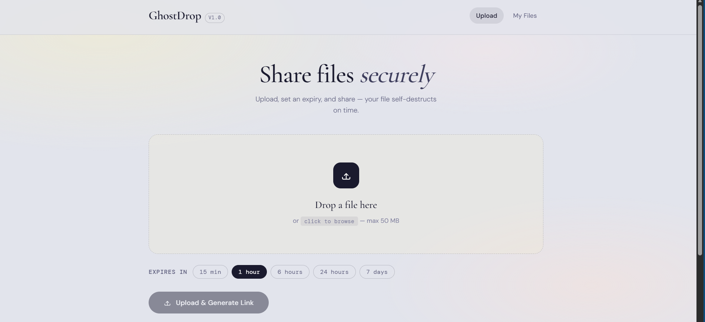
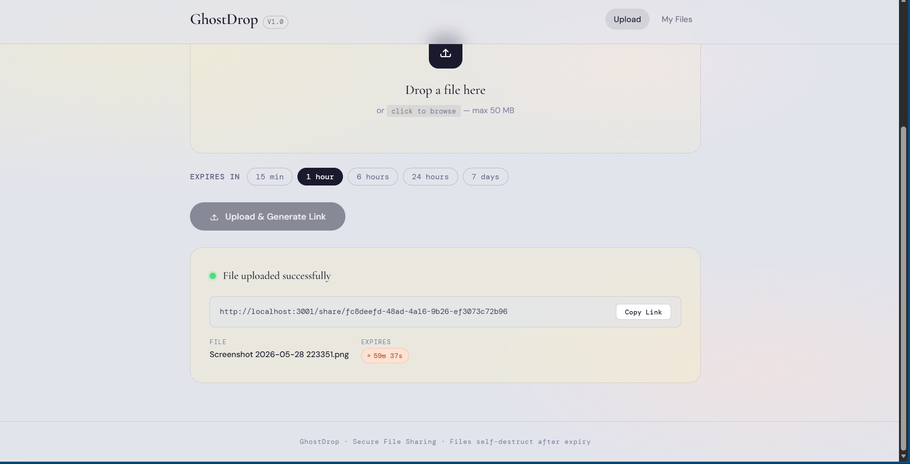
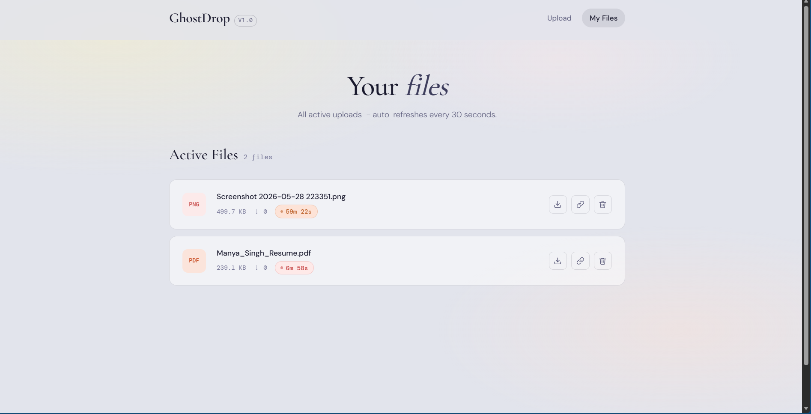

<div align="center">

# GhostDrop

**Ephemeral file sharing with self-destructing links.**

Upload a file. Share a link. Watch it disappear.

  

---



---

## What It Does

GhostDrop is a full-stack file sharing platform built for temporary, self-expiring uploads.

Users can drag and drop files into a clean upload interface, generate shareable public links, choose expiry durations, and track uploaded files through a dedicated dashboard. Once a file expires, the backend automatically deletes it from storage.

Every upload receives:

* a unique public share link
* a live expiry countdown
* download tracking
* automatic cleanup after expiration

The system is designed to feel lightweight, minimal, and frictionless — no authentication, no accounts, no unnecessary complexity.

---

## Features

| Feature                  | Description                                             |
| ------------------------ | ------------------------------------------------------- |
| Drag & Drop Upload       | Upload files instantly through a modern dropzone        |
| Expiry Timers            | 15 min / 1 hr / 6 hr / 24 hr / 7 day expiration options |
| Shareable Links          | Public `/share/:id` routes for direct file access       |
| Live Countdown           | Real-time expiry timers update automatically            |
| Auto Cleanup             | Expired files are deleted every 60 seconds              |
| File Dashboard           | View all active uploads in one place                    |
| Download Tracking        | Tracks how many times a file was downloaded             |
| Copy / Download / Delete | Full file management controls                           |

---

## Screenshots

### Upload Page


### Generated Share Link



### My Files Dashboard



---

## Getting Started

### 1 — Clone Repository

```bash id="t0v76n"
git clone <your-repository-url>
cd GhostDrop-File-Sharing-System
```

---

### 2 — Start Backend

```bash id="zpqzco"
cd backend
npm install
npm run dev
```

Backend runs on:

```bash id="zsbq8x"
http://localhost:5000
```

---

### 3 — Start Frontend

Open a new terminal:

```bash id="hjv6x0"
cd frontend
npm install
npm start
```

Frontend runs on:

```bash id="tq9xym"
http://localhost:3000
```

---

## Project Structure

```bash id="gxq22n"
GhostDrop-File-Sharing-System/
├── backend/
│   ├── server.js
│   ├── package.json
│   ├── metadata.json
│   └── uploads/
│
├── frontend/
│   ├── public/
│   │   └── index.html
│   │
│   └── src/
│       ├── components/
│       │   ├── Navbar.js
│       │   ├── FileIcon.js
│       │   ├── ExpiryBadge.js
│       │   └── Toast.js
│       │
│       ├── hooks/
│       │   ├── useToast.js
│       │   └── useCountdown.js
│       │
│       ├── pages/
│       │   ├── UploadPage.js
│       │   ├── FilesPage.js
│       │   └── SharePage.js
│       │
│       ├── utils/
│       │   ├── api.js
│       │   └── helpers.js
│       │
│       ├── App.js
│       ├── index.js
│       └── index.css
│
├── screenshots/
│   ├── upload-page.png
│   ├── generated-link.png
│   └── my-files-dashboard.png
│
└── README.md
```

---

## API Endpoints

| Method | Route                | Description            |
| ------ | -------------------- | ---------------------- |
| POST   | `/upload`            | Upload a file          |
| GET    | `/files`             | Get all active uploads |
| GET    | `/file/:shareId`     | Get file metadata      |
| GET    | `/download/:shareId` | Download uploaded file |
| DELETE | `/file/:shareId`     | Delete uploaded file   |

---

## Tech Stack

### Frontend

* React 18
* React Router v6
* Plain CSS

### Backend

* Node.js
* Express.js
* Multer
* UUID
* Nodemon

---

## Architecture

GhostDrop follows a lightweight React + Express architecture:

```bash id="5w0b3t"
Frontend (React)
    ↓ API Requests
Backend (Express)
    ↓
Local File Storage + metadata.json
```

### Frontend Responsibilities

* Upload interface
* File dashboard
* Countdown rendering
* Link generation
* Client-side routing

### Backend Responsibilities

* File uploads
* Share ID generation
* Expiry validation
* Cleanup scheduler
* Download serving
* Metadata persistence

---

## Future Improvements

* Authentication system
* Password-protected links
* Cloud storage integration
* Upload progress bars
* Dark mode
* File encryption
* Drag-to-share support

---

## Browser Compatibility

Works in all modern browsers:

| Browser | Support |
| ------- | ------- |
| Chrome  | Full    |
| Edge    | Full    |
| Firefox | Full    |
| Safari  | Full    |

---

## License

MIT — use it freely.

---

*Built with React, Express, and an unhealthy obsession with clean UI.*
